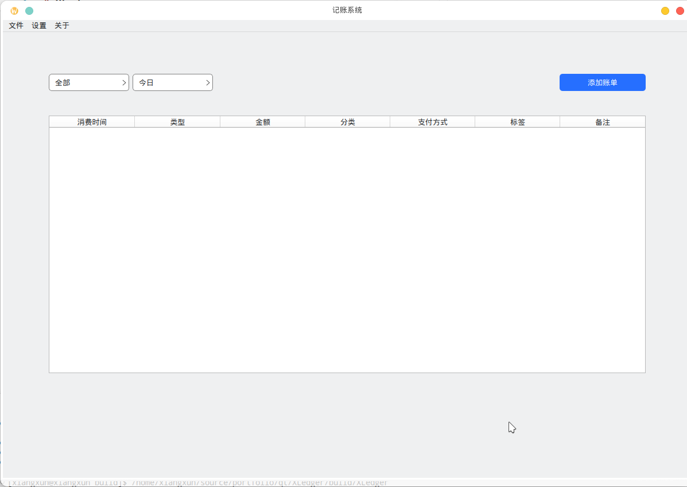

# XLedger

> 一个基于 Qt 的桌面记账应用

   


## 功能

- [x] 添加、编辑、删除账单
- [x] 分类管理（添加和删除分类和标签）
- [x] 账单数据过滤
- [x] 导出账单到excel表格
---

## 截图



---

## 依赖

- **Qt 6.11+** (Widgets)
- **CMake 3.16+**
- 可选库：
  - SQLite (内置 Qt 支持)

---

## 安装与构建

### 1. 克隆仓库

```bash
git clone https://github.com/xiangxun/XLedger.git
cd XLedger
```
### 2. 执行构建
```bash
# 打开Developer Command Prompt for VS
mkdir build
cd build
cmake .. -DCMAKE_PREFIX_PATH="to_your_qt_install_path"
cmake --build . --config Release
cmake --install . 
# 安装路径默认在源码目录的dist文件夹，可以通过 -DCMAKE_INSTALL_PREFIX=your_path 来指定安装路径
```

